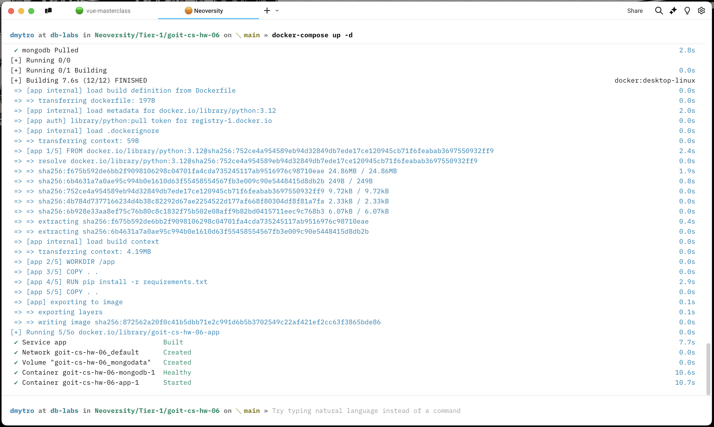
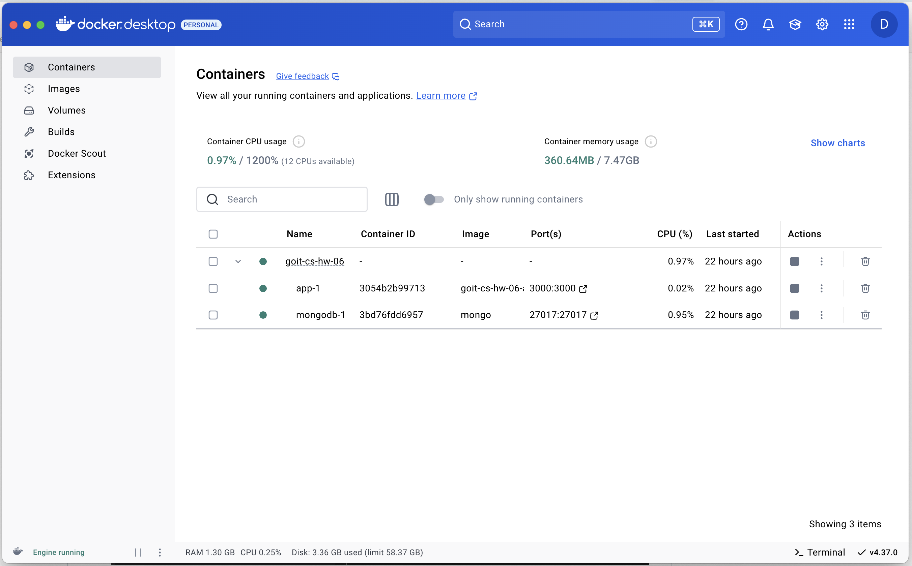
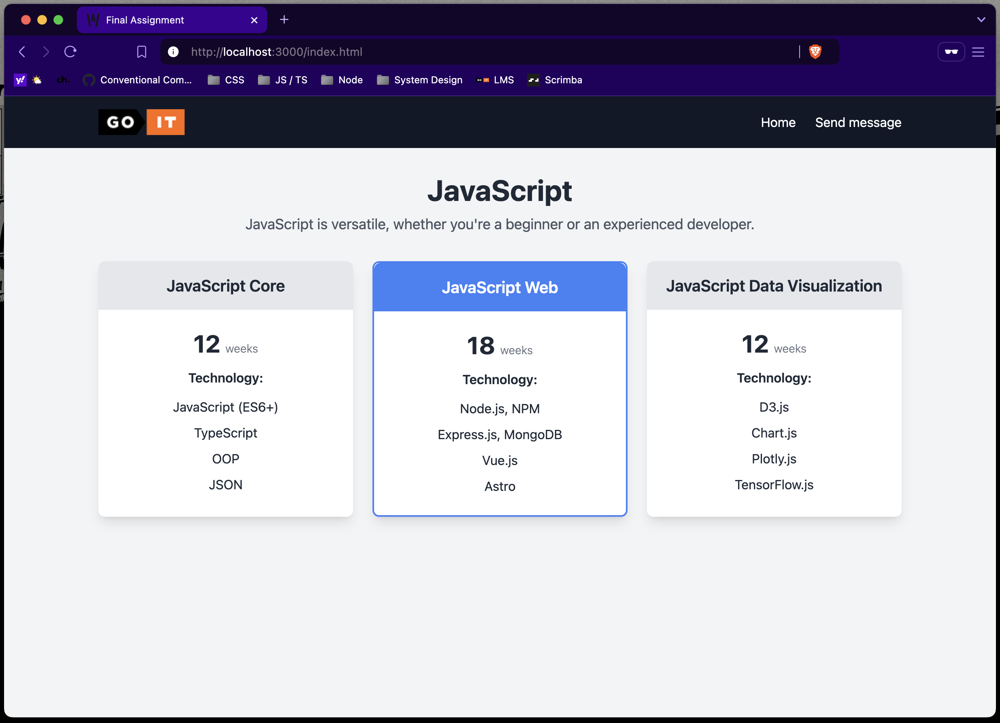
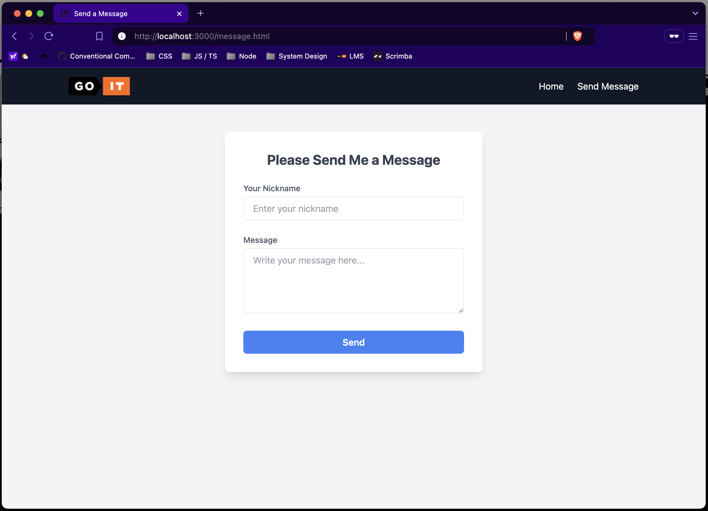
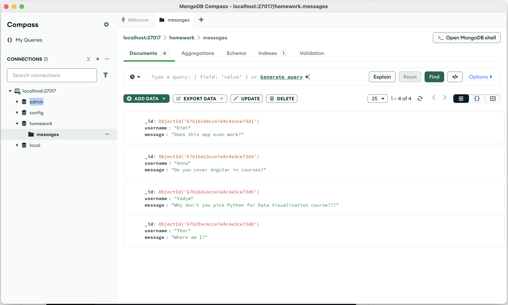
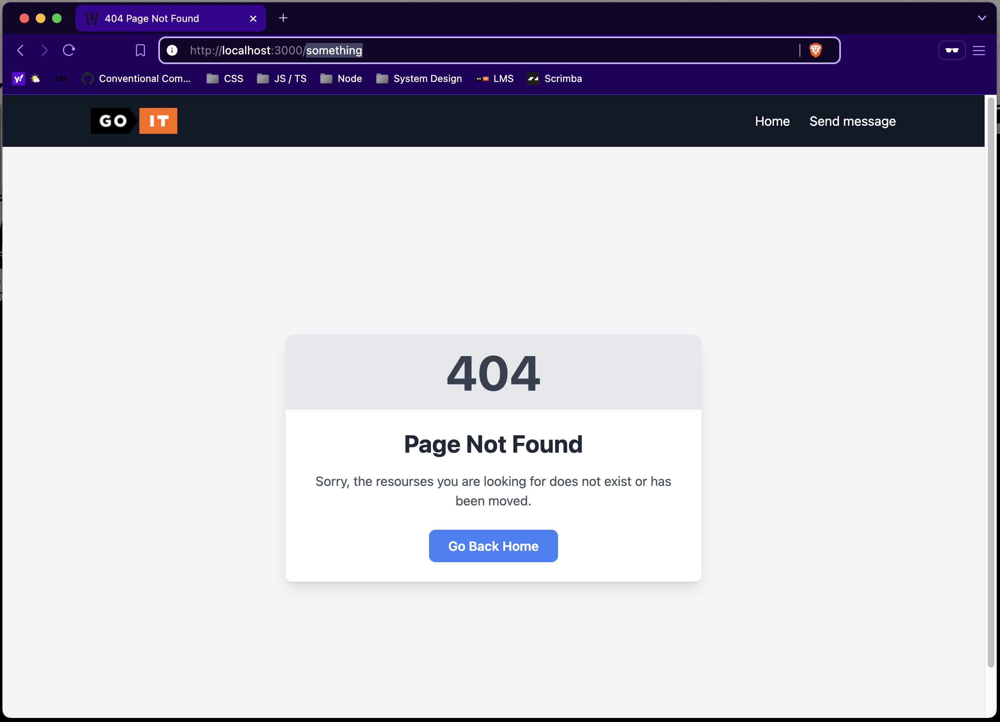

# Фінальне завдання з курсу "Computer Systems and Their Fundamentals"

Це завдання комплексне й охоплює знання з різних модулів курсу.
Мета — створення вебзастосунку, який взаємодіє з сервером за допомогою сокетів та здатний зберігати інформацію у базі даних MongoDB.

## Технічний опис завдання

Вам необхідно реалізувати найпростіший вебдодаток, не використовуючи вебфреймворк.

# Як запустити проєкт:

1. Зклонуйте репозиторій.  

2. Встановіть додаток Docker Desktop та виконайте в терміналі команду:
   `docker-compose up -d`
   
    

3. Перевірити запущені контейнери можна у тому ж додатку Docker Desktop:
   
    

4. Відкрийте у браузері [localhost:3000](http://localhost:3000).
   
    

5. У хедері перейдіть в **Send Message**, заповніть форму та натисніть **Send**.
   
    
6. Встанвіть додаток MongoDB Compass і у ньому приєднайтесь до localhost:27017. У колекції **homework/messages** будуть Ваші повідомлення.
   
    
7. Хибні марштрути у браузері також обробляються.
   
    
